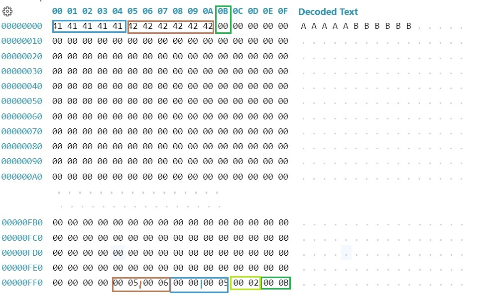

# Lab 01: Implementing a Simple Heap File System with Record Insertion and Retrieval

## Objective

In this lab, you'll implement a simple heap file system that allows for inserting, storing, and retrieving variable-length records in a paginated file. You will use low-level byte manipulation to manage records, their metadata, and free space within each page.

In this lab, the functions that manage the heap file are provided, including:
- create heap file
- Read page
- write page
- append page

After explaining these functions and bytes manipulation in Python with examples, you are required to implement the following functionalities:
1. Calculate the free space in a page.
2. Insert a record into a page.
3. Retrieve a record from a page.
4. Get all records from a file.

## The used Heap file description
The heap file follows a structure similar to that seen in the course, with a **page size of 4096 bytes**.

Each page contains a slot table located at the end of the page, starting from the last byte. 

-The footer metadata (the last 4 bytes of the page) stores:
  - 2 bytes: Offset to the start of the free space in the page.
  - 2 bytes: Number of entries in the slot table (slot count).
- Following the footer, the slot table entries are stored, with each entry containing:
  - 2 bytes: Offset of the record within the page.
  - 2 bytes: Length of the record in bytes.

The record format, in this lab, is simply  a set of bytes, for example:

```py
record_data = b'\x42\x42\x42\x42\x42\x42'
```
Alternatively, you can use string literals, which represent ASCII codes. For the example above:
```py
record_data = b'BBBBBB'
```

## Part 1: Given Functions for Setting Up the Heap File
This parts provides the function that: creates an empty heap file, and read and append page

All this function manipulate a page given:
- **file_name** the name of the file in the disk (string represents the file name)
- **page_number** the number of the page in the file starting from 0
- **page_data** the binary of the page containing always 4096 bytes

The code file begins by import section and global variable declaration

```py
import os, struct

PAGE_SIZE = 4096  # Each page is 4 KB
```
1. ### Create a Heap File

The function create_heap_file(file_name) creates a new empty heap 

```py
def create_heap_file(file_name):
    with open(file_name, 'wb') as f:  # Open in write-binary mode
        pass

```

2. ### Read page

The function read_page(file_name, page_number) reads a page given the page number.  

```py
def read_page(file_name, page_number):
    """Read a specific page (4 KB) from the heap file given the page number."""    
    # Check if the file has enough pages to contain the requested page
    file_size = os.path.getsize(file_name)
    last_page_number  = file_size // PAGE_SIZE -1
    
    if page_number > last_page_number:
        raise ValueError(f"Page {page_number} does not exist in the file.")

    with open(file_name, 'rb') as f:
        f.seek(page_number * PAGE_SIZE)  # Go to the start of the specified page
        page_data = f.read(PAGE_SIZE)  # Read the 4 KB page
    return page_data

```

3. ### Append page

The function append_page(file_name, page_data) Appends the provided page data to the end of the file. 

```py

def append_page(file_name, page_data):
    """Appends the provided page data to the end of the file."""
    if len(page_data) != PAGE_SIZE:
        raise ValueError(f"Page data must be exactly {PAGE_SIZE} bytes.")
    
    with open(file_name, 'ab') as f:  # Open in append-binary mode
        f.write(page_data)  # Append the page data to the end of the file

```

4. ### Write page

The function append_page(file_name, page_data) Appends the provided page data to the end of the file. 

```py
def write_page(file_name, page_number, page_data):
    """Write data to a specific page in the heap file."""
    # Check if the file has enough pages to contain the requested page
    file_size = os.path.getsize(file_name)
    last_page_number  = file_size // PAGE_SIZE -1
    
    if page_number > last_page_number:
        raise ValueError(f"Page {page_number} does not exist in the file.")
    if len(data) != PAGE_SIZE:
        raise ValueError(f"Data must be exactly {PAGE_SIZE} bytes long.")
    
    with open(file_name, 'r+b') as f:  # Open for reading and writing in binary mode
        f.seek(page_number * PAGE_SIZE)  # Go to the start of the specified page
        f.write(page_data)  # Write the data to the page

```
<!-- 3. #### Append page

The function append_page(file_name, page_data) Appends the provided page data to the end of the file. 

```py
def append_page(file_name, page_data):
    """Appends the provided page data to the end of the file."""
    if len(page_data) != PAGE_SIZE:
        raise ValueError(f"Page data must be exactly {PAGE_SIZE} bytes.")
    
    with open(file_name, 'ab') as f:  # Open in append-binary mode
        f.write(page_data)  # Append the page data to the end of the file

``` -->

## Part 2: Bytes manipulation in python and Page Format Explained in Bytes 

To visualize the file in binary format, we can use the Hex Editor extension in VS Code. Here is an example of the page data, which starts from byte `0x0` to byte `0xFFF` (4095).

In this example, the last two bytes (bytes 4094-4095) contain the values **00 0B** in Hex. This value indicates the offset to the free space (the number of bytes from the start of the free space).

The next 2 bytes (bytes 4092-4093) represent the number of records, which corresponds to the count of entries in the slot table (or slot count). They contain the value **00 02**, meaning we have two records and two entries in the slot table.

The following 4 bytes (values **00 00 00 05**) represent the first entry of the slot table: the first 2 bytes indicate the offset to the record (**00 00**), and the next 2 bytes indicate the length of the record (**00 05**), meaning the record starts from byte 0 and has a length of 5 bytes. Similarly, the next 4 bytes indicate the offset and length of the second record. 

Note: All values are in Hex.

1. ### Read value in given position from bytes in python

Given the variable **page_data** returned from the read page shown in the figure below, we can use the following instruction:
```py
free_space_offset = int.from_bytes(page_data[4094:4096], 'big') #  # Get the 2 bytes starting at index 4094 and ending before 4096 (non-inclusive of byte 4096).
print('Hex:', hex(free_space_offset))
print('Decimal:', free_space_offset)
```
Output
```
Hex 0xb
Decimal 11
```
We can do the same thing using the module struct
```py
import struct
free_space_offset = struct.unpack('>H', page_data[0:2])[0] 
print('Hex', hex(free_space_offset))
print('Decimal', free_space_offset)
```
Output
```
Hex 0xb
Decimal 11
```
**Explanation**

The code reads a 2-byte integer from `page_data`, starting at byte index 4094, and interprets it as a big-endian integer. Here’s a breakdown of each part:

- **`>H`**: Specifies the format for `struct.unpack`.
  - `>`: Big-endian byte order.
  - `H`: Unsigned short (2 bytes).
- **`page_data[4094:4096]`**: Extracts the 2 bytes from `page_data` starting at index 4094 and ending before 4096.- **`[0]`**: Accesses the first element in the tuple returned by `unpack`, which contains our integer value.



2. ### Write value in given position from bytes in python

To update the slot count for example in **page_data** the value in the bytes 4092-4093

```py
new_value = 2
new_value_bytes = new_value.to_bytes( 2, 'big')
page_data = (page_data[:4092]+new_value_bytes+page_data[4094:])
```
We can also use the ```pack_into``` function from the module ```struct```.

Note that pack_into requires a mutable buffer, so the bytes object needs to be converted to a ```bytearray```.

```py
new_value = 2
page_data_buffer = bytearray(page_data)
struct.pack_into('>H', page_data_buffer, 4092, new_value)  # Big-endian
page_data = bytes(page_data_buffer)
```

to insert many bytes of variable size such as record of variable length:
```py
data_bytes = b'\x41\x42\x43\x44' # the same as data_bytes = b'ABCD'
data_length = len(data_bytes)
page_data = (page_data[0:start_byte_number] + data_bytes + page_data[start_byte_number+data_length:4096])
```
We can also use the ```pack_into``` function from the module ```struct```.

```py
data_bytes = b'\x41\x42\x43\x44' # the same as data_bytes = b'ABCD'
data_length = len(data_bytes)
page_data_bytearray = bytearray(page_data)
format = f'{data_length}B'  # 'B' is for unsigned char (1 byte unsigned int)
struct.pack_into(format, page_data_bytearray, start_byte_number, *data_bytes)
page_data = bytes(page_data_bytearray)
```

## Lab directives: Managing Pages and Records 
1. ### Calculate the free space in a page
Write the function that calculates the free space give ```page_data```
```py
def Calculate_free_space(page_data):
```
```page_data``` is the 4096 bytes returned when reading a page from the file.
To calculate the free space we need to know form the ```page_data``` the free space offset and the number of records.

2. ### Insert a record to a page
```py
def insert_record_data_to_page_data(page_data, record_data):
  # check the free space vs record length
  # get the free space offset and slot count
  # insert record_data starting from free space offset
  # inserting in the new slot entry (offset and length) of the new inserted record
  # updating slot count and free space offset
  # returns he page_data with inserted record in bytes format
```
```page_data```, ```record_data``` are both binary (bytes)

using this function define the function 
```py
def insert_record_to_file(file_name, record_data):
  # Get the page that have enough free space 
  # If there is no free free space or the file is empty, create new data page of 4096 bytes
  # call insert_record_data_to_page_data function
  # write or append the page

```

to initialize new empty page with null bytes you can use
```py
  page_data = b'\x00' * PAGE_SIZE
```
3. ### Get a record form a page
```py
def get_record_from_page(page_data, record_id):
  # Retrieve a record from the specified page_data given the record ID.
```
using this function define the function 
```py
def get_record_from_file(file_name, page_number, record_id):
  #Retrieve a record from the specified page of the heap file given the record ID.
```

4. ### Get all records from a file
```py
def get_all_record_from_page(page_data, record_id):
  # Retrieve all records from the specified page_data.
```
using this function define the function 
```py
def get_all_record_from_file(file_name):
  #Retrieve all record from the specified the heap file.
```
```


